# BhuMitra - Land Area Measurement App 🌾

[](https://flutter.dev)
[](https://firebase.google.com)
[](LICENSE)

**BhuMitra** is a comprehensive Flutter application for accurate land area measurement using GPS coordinates and interactive map marking. Designed for farmers, surveyors, and land professionals.

---

## 📱 App Screenshots

<div align="center">

<p float="left">
  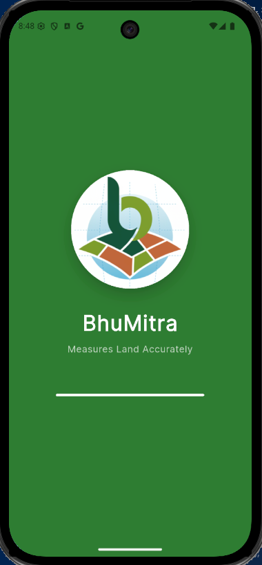
  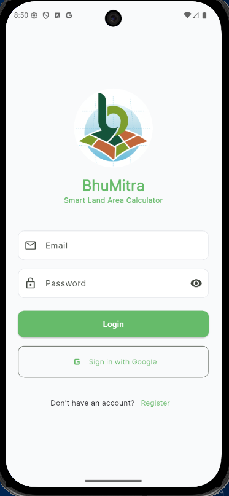
  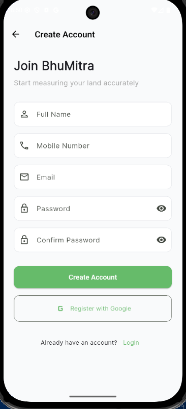
  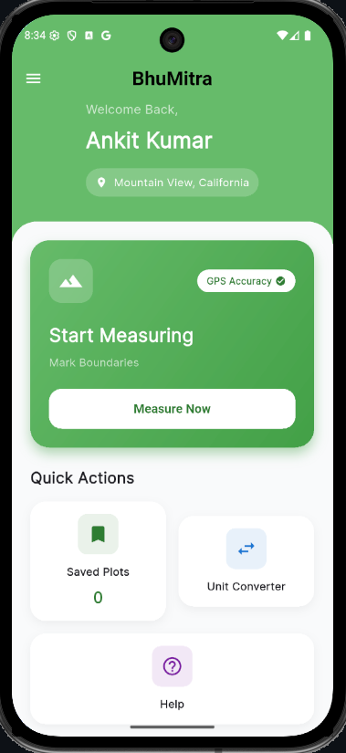
</p>

<p float="left">
  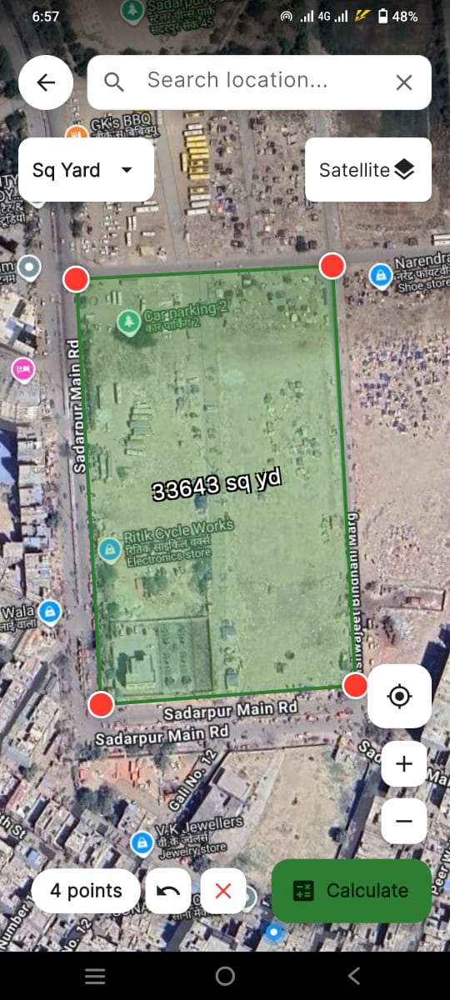
  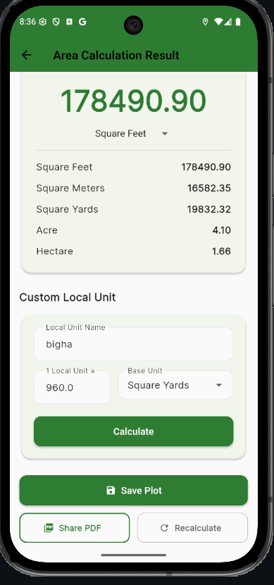
  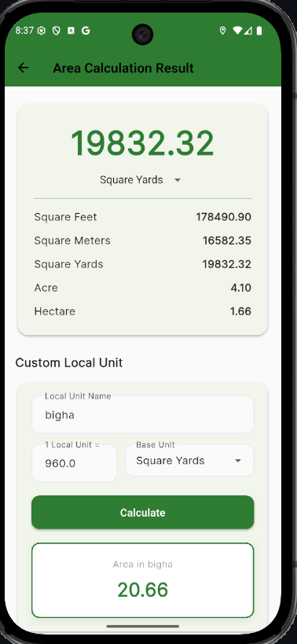
  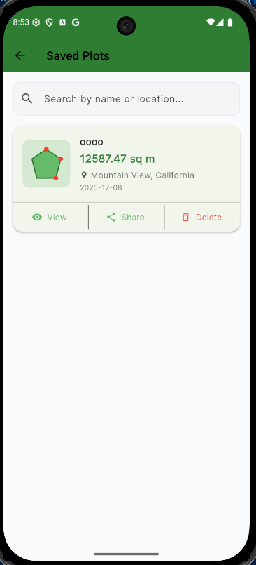
</p>

<p float="left">
  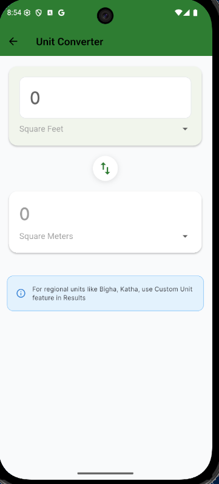
  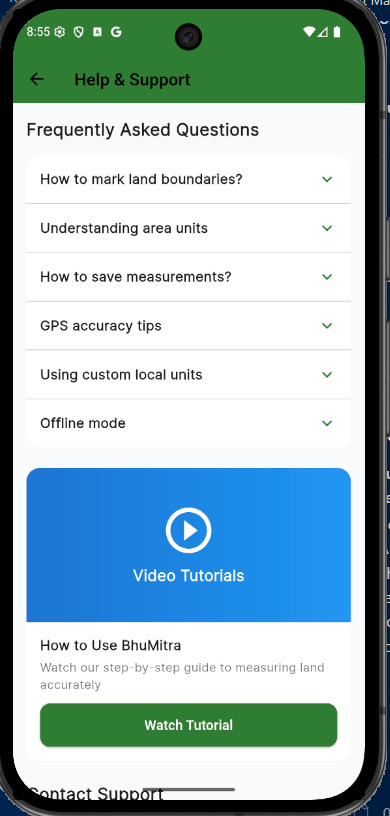
  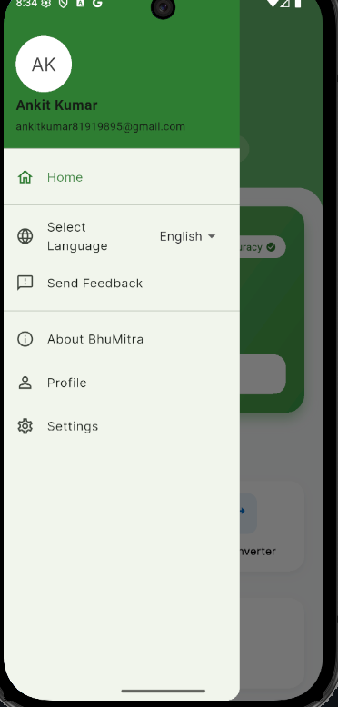
  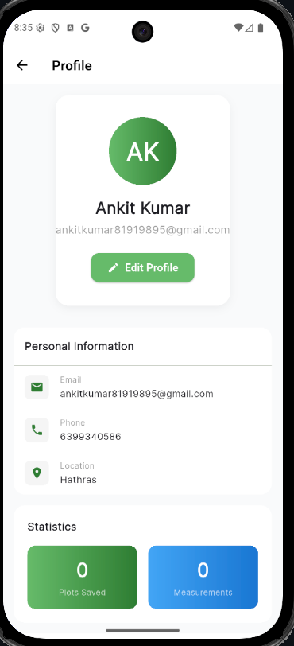
</p>

<p float="left">
  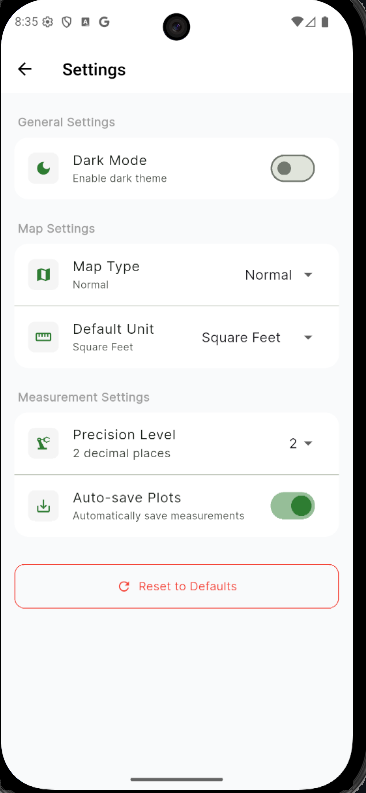
</p>

</div>

---

## ✨ Features

### Core Functionality
- **📍 Precision Mapping**: Calculate area by tapping points or dragging markers to adjust boundaries
- **🗺️ Interactive Maps**: Flutter Map with OpenStreetMap integration
- **�️ Real-Time Visualization**: High-contrast area overlay with dynamic green fill
- **💾 Save & Share**: Save plots locally and share as professional PDF reports with vector maps
- **🔄 Unit Converter**: Seamlessly switch between 5 standard units (Sq Ft, Sq M, Sq Yd, Acre, Hectare)
- **🌐 Localization**: Full English and Hindi support
- **🔐 Authentication**: Firebase Auth with email/password and Google Sign-In

### Advanced Features
- **💰 Smart Monetization**: Non-intrusive Rewarded Ads for Measure, Calculate, and Share actions
- **📊 Custom Local Units**: Define and use custom measurement units
- **📄 Professional Reports**: Generate detailed PDFs with coordinate tables and brand headers
- **🎨 Dark Mode**: Full dark theme support
- **⚡ Offline First**: Robust local storage with SharedPreferences and Firestore persistence
- **🔍 Deep Zoom**: Extended digital zoom support (up to 30x)
- **📍 GPS Location**: Real-time user location tracking

## 🚀 Quick Start

### Prerequisites
- Flutter SDK 3.10 or higher
- Dart SDK 3.10 or higher
- Android Studio / VS Code
- Firebase project setup

### Installation

1. **Clone the repository**
```bash
git clone https://github.com/ak0586/bhumitra.git
cd bhumitra
```

2. **Install dependencies**
```bash
flutter pub get
```

3. **Firebase Setup**
   - Create a Firebase project at [console.firebase.google.com](https://console.firebase.google.com)
   - Add Android/iOS apps to your Firebase project
   - Download `google-services.json` (Android) and `GoogleService-Info.plist` (iOS)
   - Place them in `android/app/` and `ios/Runner/` respectively
   - Enable Firebase Authentication (Email/Password, Google)
   - Create Firestore database with collection `users`

4. **Run the app**
```bash
flutter run
```

5. **Build APK**
```bash
flutter build apk --release
```

## 🏗️ Architecture

### State Management
- **Riverpod 2.4.9**: Modern, compile-safe state management
- **Providers**: Separate providers for user, plots, settings, and boundary points

### Navigation
- **GoRouter 13.1.0**: Declarative routing with deep linking support
- **Routes**: `/splash`, `/onboarding`, `/login`, `/register`, `/home`, `/boundary`, `/result`, `/profile`, `/settings`

### Project Structure
```
lib/
├── core/
│   ├── area_calculator.dart       # Turf-based area calculations
│   ├── auth_service.dart          # Firebase authentication
│   ├── connectivity_service.dart  # Network monitoring
│   ├── location_helper.dart       # GPS & permissions
│   ├── providers.dart             # Riverpod providers
│   ├── user_provider.dart         # User profile management
│   ├── saved_plots_provider.dart  # Plot persistence
│   ├── localization.dart          # i18n support
│   └── theme.dart                 # App theming
├── features/
│   ├── auth/                      # Authentication screens
│   ├── home/                      # Home & info screens
│   ├── boundary/                  # Map marking screen
│   ├── result/                    # Area results screen
│   ├── saved/                     # Saved plots management
│   ├── profile/                   # User profile
│   ├── settings/                  # App settings
│   └── converter/                 # Unit converter
└── main.dart                      # App entry point
```

## 📦 Dependencies

### Core
- `flutter_riverpod: ^2.4.9` - State management
- `go_router: ^13.1.0` - Navigation
- `firebase_core: ^2.24.2` - Firebase initialization
- `firebase_auth: ^4.16.0` - Authentication
- `cloud_firestore: ^4.17.5` - Cloud database

### Maps & Location
- `flutter_map: ^6.1.0` - Interactive maps
- `latlong2: ^0.9.0` - Coordinate handling
- `turf: ^0.0.1` - Geospatial calculations
- `geolocator: ^10.1.0` - GPS location
- `geocoding: ^4.0.0` - Reverse geocoding

### UI & UX
- `google_fonts: ^6.3.2` - Custom fonts
- `cached_network_image: ^3.3.1` - Image caching
- `flutter_svg: ^2.0.9` - SVG support

### Storage & Sharing
- `shared_preferences: ^2.2.2` - Local storage
- `pdf: ^3.11.1` - PDF generation
- `share_plus: ^7.2.2` - Share functionality
- `path_provider: ^2.1.5` - File paths

### Monetization
- `google_mobile_ads: ^5.0.0` - AdMob integration

## 🔧 Configuration

### Firestore Security Rules
```javascript
rules_version = '2';
service cloud.firestore {
  match /databases/{database}/documents {
    match /users/{userId} {
      allow read, write: if request.auth != null && request.auth.uid == userId;
    }
  }
}
```

### Android Permissions
```xml
<uses-permission android:name="android.permission.INTERNET"/>
<uses-permission android:name="android.permission.ACCESS_FINE_LOCATION"/>
<uses-permission android:name="android.permission.ACCESS_COARSE_LOCATION"/>
```

## 💡 Key Features Implementation

### 1. Offline-First Architecture
- Firestore offline persistence enabled
- 24-hour cache for user data
- Local storage for plots using SharedPreferences

### 2. Performance Optimizations
- Lazy loading for saved plots
- Timestamp-based caching (reduces Firebase reads by 90%)
- Image tree-shaking (99.7% font size reduction)

### 3. User Experience
- Smooth map animations
- Real-time area calculation
- Intuitive pin marking
- Comprehensive error handling
- **Optimized Performance**: Instant zoom response and efficient tile loading

## 📊 Firebase Usage Optimization

**Before Optimization**: ~3M reads/day for 1M users  
**After Optimization**: ~300K reads/day for 1M users  
**Cost Reduction**: 90%

Techniques used:
- Timestamp-based caching (24-hour TTL)
- Offline persistence
- Lazy loading
- Smart verification checks

## 🎨 Theming

The app supports both light and dark themes with a consistent green color scheme:
- Primary Color: `#2E7D32` (Green)
- Accent Color: `#66BB6A` (Light Green)
- Background: Dynamic based on theme

## 🌍 Localization

Supported languages:
- English (en)
- Hindi (hi)

Add new languages by extending `localization_data.dart`

## 🧪 Testing

```bash
# Run all tests
flutter test

# Run with coverage
flutter test --coverage
```

## 🤝 Contributing

Contributions are welcome! Please feel free to submit a Pull Request.

1. Fork the project
2. Create your feature branch (`git checkout -b feature/AmazingFeature`)
3. Commit your changes (`git commit -m 'Add some AmazingFeature'`)
4. Push to the branch (`git push origin feature/AmazingFeature`)
5. Open a Pull Request

## 📄 License

This project is licensed under the MIT License - see the [LICENSE](LICENSE) file for details.

## 👨‍💻 Author

**Ankit Kumar**
- GitHub: [@ak0586](https://github.com/ak0586)
- Email: [ankit.kumar@aus.ac.in](mailto:ankit.kumar@aus.ac.in)

## 🙏 Acknowledgments

- OpenStreetMap for map tiles
- Flutter team for the amazing framework
- Firebase for backend services
- Turf.js for geospatial calculations

## 📞 Support

For support, email ankitkumar81919895@gmail.com or open an issue in the GitHub repository.

---

**Made with ❤️ using Flutter**
